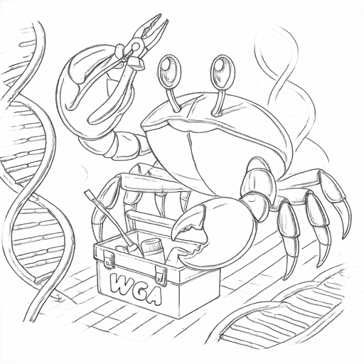

[](https://anaconda.org/bioconda/wgatools)


## *W*hole *G*enome *A*lignment **T**ools



## A Rust library and tools for whole genome alignment files

## Table of Contents

- [Citation](#citation)
- [Install](#install)
  - [Conda](#conda)
  - [Build from source](#build-from-source)
  - [Nix](#nix)
  - [Docker and Singularity](#docker-and-singularity)

- [Tools](#tools)
  - [Usage](#usage)
  - [Auto-Completion for easy-use](#auto-completion-for-easy-use)
  - [Format Conversion](#format-conversion)
  - [Dotplot for MAF/PAF file](#dotplot-for-mafpaf-file)
  - [Extract regions from MAF file](#extract-regions-from-maf-file)
  - [View MAF file in terminal](#view-maf-file-in-terminal)
  - [Call Variants from MAF file](#call-variants-from-maf-file)
  - [Chunk MAF file by length](#chunk-maf-file-by-length)
  - [Statistics for MAF/PAF file](#statistics-for-mafpaf-file)
  - [Validate and fix PAF file](#validate-and-fix-paf-file)
  - [Filter records for MAF/PAF file](#filter-records-for-mafpaf-file)
  - [Rename MAF file](#rename-maf-file)
  - [PAF Coverage for all-to-all alignment](#paf-coverage-for-all-to-all-alignment)
  - [Generate pseudo MAF from all-to-all PAF](#generate-pseudo-maf-from-all-to-all-paf)

- [Library](#library)
- [Features](#features)
- [Benchmark](#benchmark)
- [ROADMAP](#roadmap)
- [Contributing](#contributing)
- [License](#license)

## Citation

If you use `wgatools` in your research, please cite:

[Wenjie Wei, Songtao Gui, Jian Yang, Erik Garrison, Jianbing Yan, Hai-Jun Liu, Wgatools: an ultrafast toolkit for manipulating whole genome alignments, Bioinformatics, 2025;, btaf132,](https://doi.org/10.1093/bioinformatics/btaf132)

<details>

<summary>BibLaTeX</summary>

```bibtex
@article{weiWgatoolsUltrafastToolkit2025,
  title = {Wgatools: An Ultrafast Toolkit for Manipulating Whole Genome Alignments},
  shorttitle = {Wgatools},
  author = {Wei, Wenjie and Gui, Songtao and Yang, Jian and Garrison, Erik and Yan, Jianbing and Liu, Hai-Jun},
  date = {2025-03-27},
  journaltitle = {Bioinformatics},
  shortjournal = {Bioinformatics},
  pages = {btaf132},
  issn = {1367-4811},
  doi = {10.1093/bioinformatics/btaf132},
  url = {https://doi.org/10.1093/bioinformatics/btaf132},
  urldate = {2025-03-28},
}
```

</details>

## Install

### Conda

```shell
conda install wgatools -c bioconda
```

### Build from source

```shell
git clone https://github.com/wjwei-handsome/wgatools.git
cd wgatools
cargo build --release
```

or just install from git:

```shell
cargo install --git https://github.com/wjwei-handsome/wgatools.git
```

### Nix

A [nix](https://nixos.org/) flake is also available. You can build from within the repo like this:

```shell
nix build .#wgatools
```

Or directly install from github:

```shell
nix profile install github:wjwei-handsome/wgatools
```

### Docker and Singularity

Using nix, we can derive docker and singularity images:

```shell
nix build .#dockerImage
```

First, we load the docker image into the local daemon:

```shell
docker load < result
```

It's then possible to pack up a singularity image:

```shell
singularity build wgatools-$(git log -1 --format=%h --abbrev=8).sif docker-daemon://wgatools:latest
```

This can be useful when running on HPCs where it might be difficult to build wgatools.

### Guix

Clone wgatools repo and create a Guix shell to build and hack on wgatools:

```
cd wgatools
guix shell --share=/home/wrk/.cargo -C -D -N rust rust-cargo openssl nss-certs nss coreutils-minimal which perl make binutils gcc-toolchain pkg-config cmake zlib
env LD_LIBRARY_PATH=$GUIX_ENVIRONMENT/lib CC=gcc cargo build
```

The `--share` switch prevents redownloading cargo packages. `-C -D` defines a build container that is independent of the underlying
Linux distribution. `-N` gives network access to the guix shell and `-F` provides the Linux file system hierarchy standard (FHS).

Note that `cargo build --release` build does not work (yet). There is some problem with cargo+ctest+static builds.

## Tools

### Usage

```shell
> wgatools
wgatools -- a cross-platform and ultrafast toolkit for Whole Genome Alignment Files manipulation

Version: 0.1.0

Authors: Wenjie Wei <wjwei9908@gmail.com>

Usage: wgatools [OPTIONS] <COMMAND>

Commands:
  maf2paf         Convert MAF format to PAF format [aliases: m2p]
  maf2chain       Convert MAF format to Chain format [aliases: m2c]
  paf2maf         Convert PAF format to MAF format [aliases: p2m]
  paf2chain       Convert PAF format to Chain format [aliases: p2c]
  chain2maf       Convert Chain format to MAF format [aliases: c2m]
  chain2paf       Convert Chain format to PAF format [aliases: c2p]
  maf-index       Build index for MAF file [aliases: mi]
  maf-ext         Extract specific region from MAF file with index [aliases: me]
  chunk           Chunk MAF file by length [aliases: ch]
  call            Call Variants from MAF file [aliases: c]
  tview           View MAF file in terminal [aliases: tv]
  stat            Statistics for Alignment file [aliases: st]
  dotplot         Plot dotplot for Alignment file [aliases: dp]
  filter          Filter records for Alignment file [aliases: fl]
  rename          Rename MAF records with prefix [aliases: rn]
  maf2sam         DEV: maf2sam [aliases: m2s]
  pafcov          Calculate coverage for PAF file [aliases: pc]
  pafpseudo       Generate pesudo-maf for divergence analysis from PAF file [aliases: pp]
  gen-completion  Generate completion script for shell [aliases: gc]
  validate        Validate and fix query&target position in PAF file by CIGAR [aliases: vf]
  help            Print this message or the help of the given subcommand(s)

Options:
  -h, --help     Print help (see more with '--help')
  -V, --version  Print version

GLOBAL:
  -o, --outfile <OUTFILE>  Output file ("-" for stdout), file name ending in .gz/.bz2/.xz will be compressed automatically [default: -]
  -r, --rewrite            Bool, if rewrite output file [default: false]
  -t, --threads <THREADS>  Threads, default 1 [default: 1]
  -v, --verbose...         Logging level [-v: Info, -vv: Debug, -vvv: Trace, defalut: Warn]
```

**Each subcommand could be used with `-h` or `--help` to get more information.**

### Auto-Completion for easy-use

```shell
wgatools gen-completion --shell fish > ~/.config/fish/completions/wgatools.fish
```
Ready to enjoy it!

### Format Conversion

Three mainstream formats([PAF](https://github.com/lh3/miniasm/blob/master/PAF.md), [MAF](https://genome.ucsc.edu/FAQ/FAQformat.html#format5), [CHAIN](https://genome.ucsc.edu/goldenPath/help/chain.html)) can be converted to each other.

For example, to convert MAF to PAF:

```shell
wgatools maf2paf test.maf > test.paf
```

or to convert PAF to MAF:

```shell
wgatools paf2maf test.paf --target target.fa --query query.fa > test.maf
```

> [!TIP]
> If you want to convert into MAF format, you should provide target and query genome sequence files in {.fa, .fa.gz}.

stdin and stdout are supported, so you can use pipes to chain commands together🪆:

```shell
cat test.maf | wgatools maf2paf | wgatools paf2maf -g target.fa -q query.fa > test.maf

wgatools paf2chain test.paf | wgatools chain2maf -g target.fa -q query.fa | wgatools maf2chain | wgatools chain2paf > funny.paf
```

### Dotplot for MAF/PAF file

We provide two modes for plot, for example:

- BaseLevel


This mode can catch the alignment details in each record, such as matches, insertions and deletions. This can help us to better observe the local alignment.

```shell
wgatools dotplot -f paf test/testdotplot.paf > out.html
```

By default, INDELs smaller than `50bp` are merged with adjacent match. You can also use the parameter `-l, --length` to specify the threshold.

In Interactive html, you can click on the legend to view only the types of interest, for example:


> [!WARNING]
>NOTE: For better interactivity, the `zoom` function is turned on. However, if there is too much data, the effect may be limited by your browser performance.
For Better performance, you can collapse short segments by `-l` parameter.

This [simple example](https://github.com/wjwei-handsome/wgatools/blob/master/test/test.html) can be found in the [test](https://github.com/wjwei-handsome/wgatools/tree/master/test) directory.

- Overview


Similar to common dotplot scripts, it will draw each align record and color it according to identity.

```shell
wgatools dotplot test.maf -m overview > overview.html
```

😎 For [`vega`](https://vega.github.io) and DIY hackers, we also provide output in json(vega schema) and csv formats.
Official tool [vl-converter](https://github.com/vega/vl-convert) can convert json files to multiple formats.

### Extract regions from MAF file

The line of MAF file is so long that it's hard to read. You can use `maf-ext` to extract specific region from MAF file with index:

```shell
wgatools maf-index test.maf

wgatools maf-extract test.maf -r chr1:1-10,chr2:66-888,chr3:100-50,chr_no:1-10,x:y-z
```
> [!TIP]
> 1. Support multi-interval input, separated by commas
> 2. Support `bed` input to specify interval
> 3. Mismatched interval are skipped and warned

### View MAF file in terminal

View the MAF file in the terminal smoothly, and you can also specify the area to view:

```shell
wgatools tview test.maf
```


Press <kbd>◄</kbd><kbd>►</kbd> to slide left and right.

Press <kbd>q</kbd> to exit.

Press <kbd>g</kbd> to bring up the navigation window, where the left side is the optional sequence name, and the right side is the optional interval of the selected sequence, you can press <kbd>Tab</kbd> to switch the left and right selection windows, and you can press <kbd>▲</kbd><kbd>▼</kbd> to select the sequence and interval

After input a legal interval, you can Press <kbd>Enter</kbd> to jump to the Destination.
Or press <kbd>Esc</kbd> to exit the navigation window.

### Call Variants from MAF file

The MAF format completely records the alignment of each base, so it can be used to identify variants.

Supported explicit varaint types:
- SNP
- INS
- DEL
- INV

The default parameter does not output `SNP` and short `INS` and `DEL` (<50). The example is as follows:

```shell
wgatools call test/test.maf -s -l0
```

or directly use PAF file with target and query sequence:

```shell
wgatools call test/test.paf -s -l0 --target target.fa --query query.fa -f paf
```

Output vcf:
```
##fileformat=VCFv4.4
##INFO=<ID=SVLEN,Number=A,Type=Integer,Description="Length of structural variant">
##INFO=<ID=SVTYPE,Number=1,Type=String,Description="Type of structural variant">
##INFO=<ID=END,Number=1,Type=Integer,Description="End position of the longest variant described in this record">
##INFO=<ID=INV_NEST,Number=1,Type=String,Description="Varations nested within inversion">
##FORMAT=<ID=QI,Number=1,Type=String,Description="Query informations">
##FORMAT=<ID=GT,Number=1,Type=String,Description="Genotype">
#CHROM	POS	ID	REF	ALT	QUAL	FILTER	INFO	FORMAT	sample
ref.chr8	181470034	.	TG	T	.	.	SVTYPE=DEL;SVLEN=1;END=181470035	GT:QI	1|1:query.chr8@181989530@181989530@P
ref.chr8	181470279	.	G	C	.	.	.	GT	1|1
ref.chr8	181470292	.	A	G	.	.	.	GT	1|1
ref.chr8	181470431	.	C	G	.	.	.	GT	1|1
ref.chr8	181470609	.	C	A	.	.	.	GT	1|1
ref.chr8	181470641	.	C	T	.	.	.	GT	1|1
ref.chr8	181470774	.	A	AAACCAAGA	.	.	SVTYPE=INS;SVLEN=8;END=181470774	GT:QI	1|1:query.chr8@181990269@181990277@P
ref.chr8	181470793	.	G	T	.	.	.	GT	1|1
ref.chr8	181470894	.	C	T	.	.	.	GT	1|1
ref.chr8	181470895	.	A	T	.	.	.	GT	1|1
ref.chr8	181470903	.	G	A	.	.	.	GT	1|1
```
> [!IMPORTANT]
> This function does not support the identification of chromosomal rearrangements such as `DUP`, as this requires the extraction of sequences for realignment.

### Chunk MAF file by length

You can split a huge MAF record into multiple records by length:

```shell
wgatools chunk -l 100 test/test.maf -o chunked.maf
```
### Statistics for MAF/PAF file

```shell
wgatools stat test.maf
wgatools stat -f paf test.paf
wgatools stat test.maf
```

### Validate and fix PAF file

In some cases, the PAF file may be incorrect, such as the `query` and `target` [postions are wrong](https://github.com/wjwei-handsome/wgatools/issues/15), or CIGAR string is unmatch with sequences. You can use this command to validate and fix the PAF file:

```shell
## just validate
> wgatools validate wrong.paf

Total records: 2306
Query invalid records: 2283
Target invalid records: 80
Query invalid list:...
Target invalid list:...
## validate and fix
> wgatools validate wrong.paf -f happy.paf

```

### Filter records for MAF/PAF file

You can filter some records by `block length` or `query_size`.

For example, to filter records that `contig vs reference`:

```shell
wgatools filter test.maf -q 1000000 > filt.maf
```

For `all-to-all` alignment paf file which produced by [`wfmash`](https://github.com/waveygang/wfmash), you can filter some pairs by `align-size`:

```shell
wgatools filter all2all.paf -a 1000000 > filt.maf
```

### Rename MAF file

In some practices, the chromosome name of `ref` and `query` are both called `chr1`, which is not easy to distinguish.
You can rename the sequence name in MAF file with a prefix:

```shell
wgatools rename --prefixs REF.,QUERY. input.maf > rename.maf
```

### PAF Coverage for all-to-all alignment

If you have alignment results for multiple genomes, you can use this command to calculate the alignment coverage on the genomes. It's optimized to use with [`wfmash`](https://github.com/waveygang/wfmash) output.

```shell
wgatools pafcov all.paf > all.cov.beds
```

### Generate pseudo MAF from all-to-all PAF

```shell
wgatools pafpseudo -f all.fa.gz all.paf -o out_dir -t 10
```


> [!TIP]
> Practical processes and profile can refer to this [pipleline](https://github.com/T2T-apes/ape_pangenome) and this [paper](https://www.biorxiv.org/content/10.1101/2024.07.31.605654v1.article-info)


## Library

Some simple reader and iterator for PAF, MAF and Chain files:

```rust
use wgatools::parser::paf::PafReader;
use wgatools::parser::maf::MAFReader;
use wgatools::parser::chain::ChainReader;
fn main() {
    let mut mafreader = MAFReader::from_path("test.maf").unwrap();
    for record in mafreader.records() {
        let record = record.unwrap();
        println!("{:?}", record);
    }
    /// ...
}
```


[//]: # "> It should be extremely fast!"

## Features

- use `nom` to parse CIGAR string
- use `rayon` to accelerate the speed of conversions
- use `ratatui` to visualize MAF file in terminal
- ...

## Benchmark

We use the [`hyperfine`](https://github.com/sharkdp/hyperfine) to compare the speed of conversion between `wgatools` and another Rust-based tool [`paf2chain`](https://github.com/AndreaGuarracino/paf2chain). The result is as follows (10 runs):


command|mean(sec)|stddev|median|user|system|min|max
:---------------------------------------------------------------------------------------------------------|:-----------------|:-----------------|:-----------------|:----------------|:-----------------|:-----------------|:-------------
wgatools p2c Zm-CML333.paf -o foo|3.69|0.36|3.71|3.46|0.14|3.25|4.09
paf2chain --input Zm-CML333.paf > bar|16.28|0.86|16.27|3.80|12.03|15.01|17.67


## ROADMAP

- [ ] SAM converter
- [ ] Local improvement of alignment by re-alignment
- [ ] MAF -> GAF -> HAL
- [ ] output gvcf for variants
- [X] call variants from PAF directly


## Contributing

Feel free to dive in! [Open an issue](https://github.com/wjwei-handsome/wgatools/issues/new) or submit PRs.

## License

[MIT License](./LICENSE) © WenjieWei
